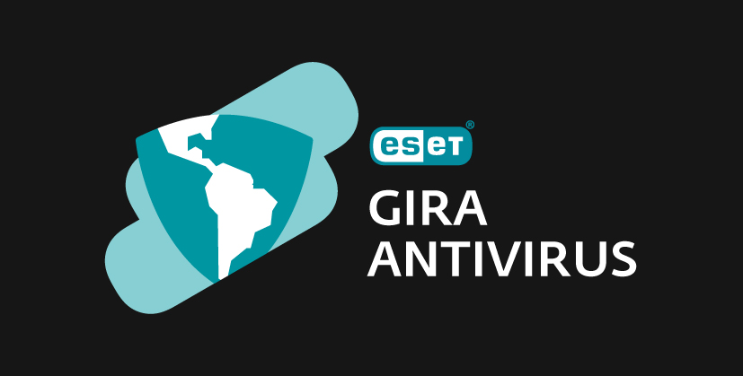

<h1>
  
  PROJECT!! ESET_GiraAV-Knowledge-Base
</h1>

  Este repositorio está diseñado para servir como un punto de referencia para entusiastas, estudiantes y quienes deseen aprender sobre ciberseguridad. Reúne herramientas, cursos y recursos para toda las ramas de la ciberseguridad.  
  Desde redes, red teaming, OSINT, análisis forense y más.
  

## 📖 Contenidos  

- [🎓 Cybersecurity University](Cybersecurity_University/Readme.md) 
- [🔧 Specialized Tools by Topic](Tools/Readme.md)  
- [🏴‍☠️ CTF (Capture The Flag)](CTF/Readme.md)  
- [💰 Bug Bounty ](BugBounty/Readme.md)  
- [📚 English](Ingles/Readme.md)  
- [📂Otros Recursos](OtrosRecursos/Readme.md)  
 

#### 🚀 ¡Sigue Aprendiendo!  

La ciberseguridad es un campo en constante evolución, donde el aprendizaje nunca se detiene. Esperamos que este repositorio te ayude a mejorar tus habilidades, descubrir nuevas herramientas y avanzar en tu camino profesional.  

🔹 **Alentamos la curiosidad, la ética y el aprendizaje continuo.** Usa estos recursos con responsabilidad y siempre con el objetivo de fortalecer la seguridad  digital.  

🔹 **Contribuye y comparte.** Si tienes sugerencias o quieres agregar contenido, no dudes en hacer un **pull request** o abrir un **issue**.  

🔹 **Forma parte de la comunidad.** La mejor manera de crecer es compartiendo conocimientos, participando en eventos y colaborando con otros apasionados por la seguridad.  

🛡**Good luck!** 🏴‍☠️🚀  

